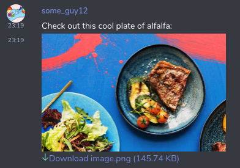

# MSC2448: Using BlurHash in Media Events

[BlurHash](https://blurha.sh) is a compact representation of a placeholder
for an image (or the frame of a video). Currently in Matrix, clients must
display a placeholder image in the message timeline while a piece of media is
loading. Some clients, such as Riot, simply display an empty space.

While thumbnails exist to combat this to some degree, they still need to be
downloaded from a homeserver, which is not instantaneous.

Instead, a blurhash can be sent inside the `m.room.message` event, which upon
receipt other clients can render for a pretty preview while the actual
thumbnail downloads.

## Proposal

A new field is added in `m.room.message`'s content field called `blurhash`.
It is a BlurHash of the original piece of media. Clients could then render
this using [one of the available BlurHash
implementations](https://github.com/woltapp/blurhash).

This would be displayed while the thumbnail of the media is loaded in parallel.

This is beneficial as it's an extremely efficient way to give someone a quick
idea of what a piece of media contains before any requests are made to a
media repository.

To be clear: This does not replace thumbnails - it will be shown before they
are downloaded.

## Visualisation

Viewing an image message that is loading:

Once the image loads:

For reference, the current state of things in Riot is:

## Alternatives

We could include a base64 thumbnail of the image in the event, but blurhash
produces much more efficient textual representations.

## Backwards compatibility

Older clients would ignore the new `blurhash` parameter.

Newer clients would only show it if it exists.
